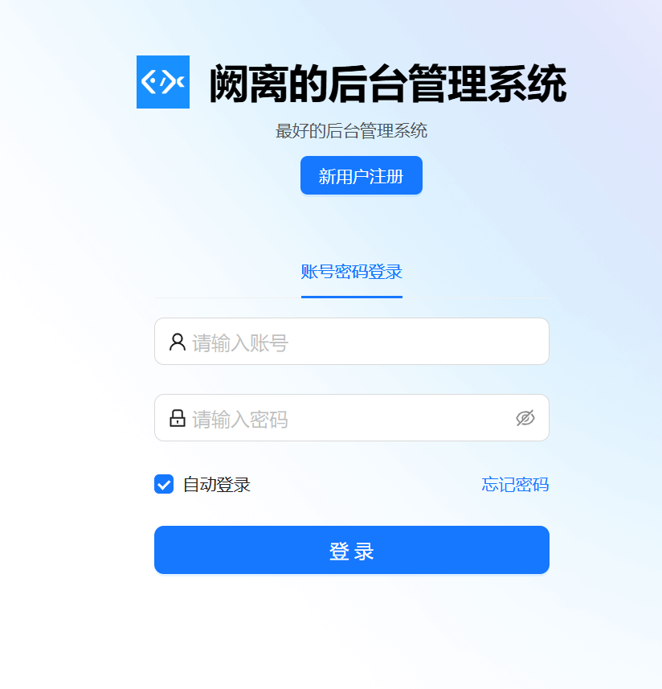
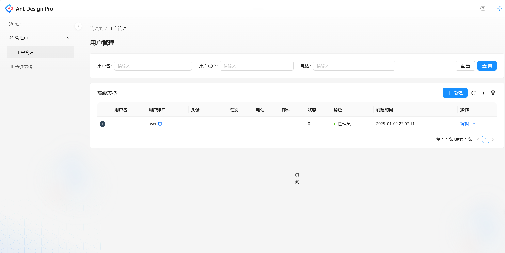

# <h1 style="text-align: center;">阙离的用户中心管理项目</h1>

# 项目介绍
## 该项目是阙离在线学习项目
前端：html+css+javascrip+React+组件库Ant Design + Umi + Ant Design pro(现成的管理系统)  
后端：java + spring +springmvc + mybatis + mybatisplus + springboot + mysql
## 主要功能包括：
1. 用户注册、登录、注销
2. 用户信息、角色管理
3. 用户信息查询
#

## 从前端到后端以及上线部署项目，历时20天完成
学习过程中，我遇到很多问题，比如:  
- 在使用前端框架时，被 access: 'canAdmin' 卡住，这是一个判断是否为管理员的参数。当我尝试了多次后，发现在umi中，admin.jsx中，我定义了access，但是我在调整java后端项目返回数据的时候忘记调整获取这个参数的代码，导致admin页面不存在。
- 在不断进行剖析中，解决了这个问题，特此纪念，//第十六天